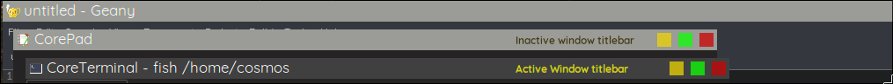

# WinDecor Plugin for Wayfire

This is a fork of <https://gitlab.com/wayfireplugins/windecor> adding window shadows.

## Compile and install
You should have first compiled and installed wlroots, wf-config and wayfire.

- Get the sources
  - `git clone https://github.com/timgott/wayfire-windecor-shadows.git`
- Enter the `wayfire-windecor-shadows`
  - `cd wayfire-windecor-shadows`
- Configure the project - we use meson for project management
  - `meson build --prefix=/usr --buildtype=release`
- Compile and install - we use ninja
  - `ninja -C build -k 0 -j $(nproc) && sudo ninja -C build install`

## Usage
To use windecor plugin to render the decorations, disable all other decoration plugins. You may use wcm to configure your wayfire config file.
If you make changes to the configurations, you will have to close and restart wayfire for the changes to take effect.

## Previous changes
1. `icon_theme` - Previously, the icon theme was set using env variable. Now the env variable is no longer used.
2. `work_hard` - Sometimes, matching the app_id to the correct desktop file is difficult. Especially if the binary name and the desktop names
differ. In such cases, you can ask windecor to look into all desktop file in the hope of matching the app_id with an executable name. However,
note that this operation is resource-hungry. The default value is false. A nice default icon is painted if we could not get any icon names.
